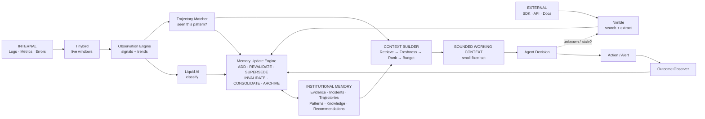
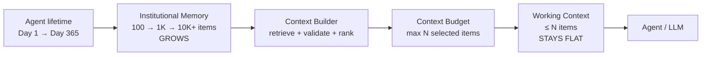
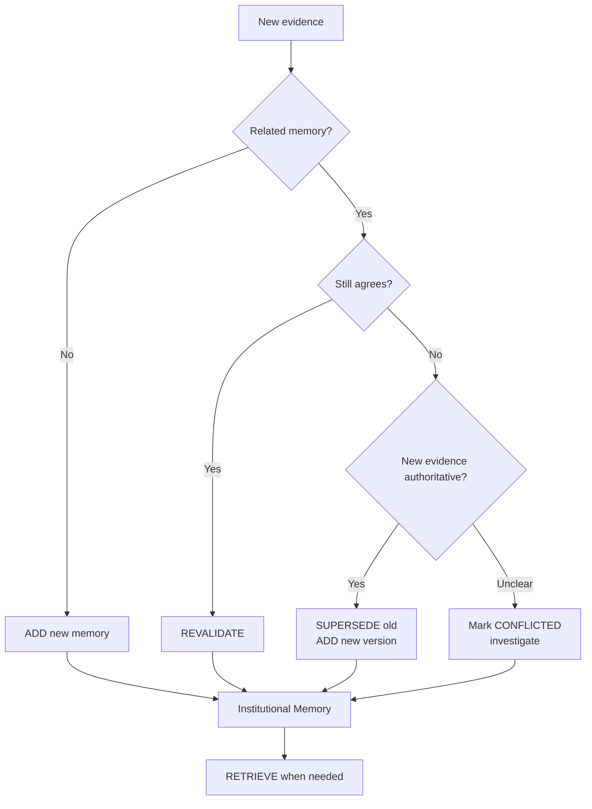
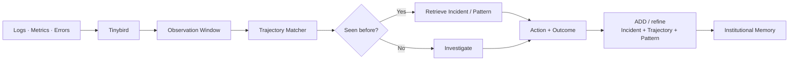
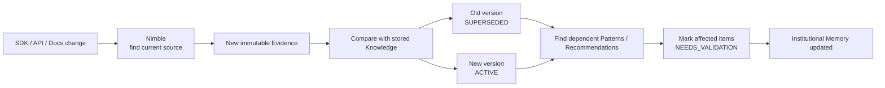
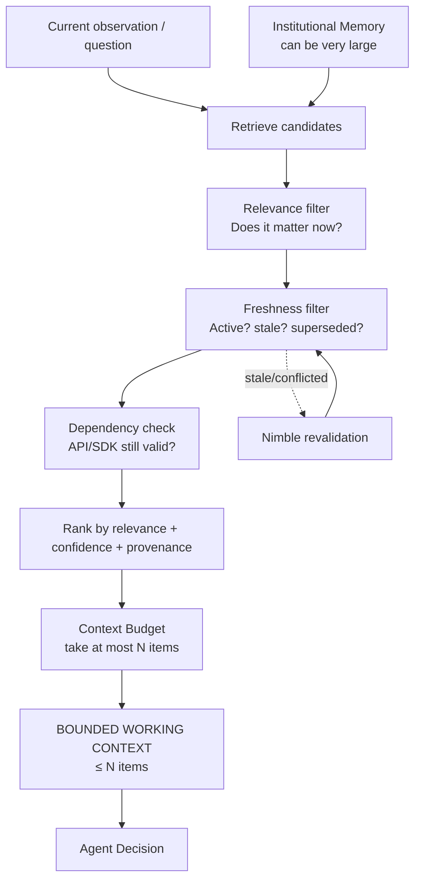
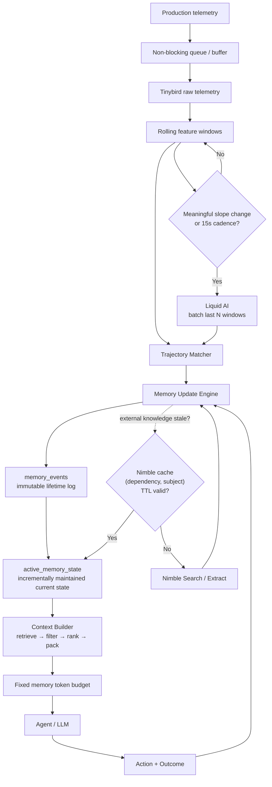
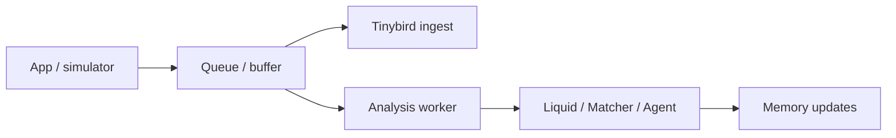

# DéjàVu — Long-Horizon Agent Memory

> **Your production system has seen this before.**

DéjàVu is a long-horizon agent memory system. It learns from internal production behavior and external API/SDK knowledge changes, preserves historical evidence, keeps current knowledge fresh, and retrieves only a bounded amount of memory for each agent decision.

The core question is not just *“Have we seen this before?”* It is **“Have we seen this before — and is what we learned last time still true?”**

## 1. Complete top-level flow

This is the **one diagram to understand DéjàVu**. There are two inputs into the same long-horizon memory system:

- **Internal:** production logs, metrics, events, errors.
- **External:** SDK/API/docs/changelog changes.

The key idea is simple: **Institutional Memory can keep growing, while the Context Builder gives the LLM a small, fixed working context.**



### Read it in one sentence

```text
Internal events OR external changes
        ↓
understand what changed
        ↓
update / retrieve Institutional Memory
        ↓
Context Builder selects only what matters NOW
        ↓
fixed-size Working Context
        ↓
Agent decides
        ↓
outcome becomes new memory
```

## 2. Flat context: memory grows, context does not

This is a core long-horizon property, not an optimization detail.



```text
Institutional Memory
10K |                              /
    |                          /
 5K |                     /
    |                /
 1K |          /
    |     /
  0 +--------------------------------→ time
       Day 1      Day 30      Day 365

Working Context
 N  |--------------------------------  ← fixed budget
    |
  0 +--------------------------------→ time
```

**DéjàVu's memory grows with the lifetime of the agent. Its context window doesn't.**


## Institutional Memory

**Purpose:** preserve the agent's experience across time while keeping current knowledge trustworthy.

Institutional Memory stores six simple things:

```text
Evidence → Incidents → Trajectories → Patterns
    │                                   │
    └────────→ Knowledge ─────────→ Recommendations
```

Raw evidence and historical incidents are preserved. Derived knowledge can change status or version as the world changes.

### How memory is managed



### Internal path — logs / events / errors

This is how production experience becomes memory.



Example: `pool ↑ → queue ↑ → p99 ↑ → timeouts ↑ → outage`. The pre-failure sequence is stored so the next occurrence can be recognized earlier.

### External path — SDK / API / docs change

This is how the agent prevents old knowledge from becoming bad advice.



**Important:** the old knowledge is not deleted. We preserve **what was true then** separately from **what is safe to recommend now**.

### ADD vs UPDATE vs RETRIEVE

| Operation | Meaning |
|---|---|
| **ADD** | New incident, evidence, trajectory, pattern, or knowledge |
| **REVALIDATE** | Existing knowledge is checked and still true |
| **SUPERSEDE** | New authoritative version replaces current use of old knowledge |
| **INVALIDATE** | A belief is shown to be wrong; history is preserved |
| **CONSOLIDATE** | Merge duplicate derived memories without deleting source evidence |
| **ARCHIVE** | Remove old items from normal retrieval, not from history |
| **RETRIEVE** | Context Builder selects relevant, valid memories for the current decision |

[↑ Back to top-level flow](#1-complete-top-level-flow)


## Context Builder

**Purpose:** convert a large, growing Institutional Memory into a **small, trustworthy, bounded working set** for the current decision.



The Context Builder does **not** summarize the entire lifetime into the prompt. Old evidence stays in Institutional Memory for history/provenance, but only relevant and currently valid items consume working context.

Example:

```text
12,481 memory objects
        ↓ retrieve
       37 candidates
        ↓ relevance
       11
        ↓ freshness/dependency validation
        6
        ↓ context budget (max 8)
   WORKING CONTEXT = 6 / 8
        ↓
   Agent Decision
```

[↑ Back to top-level flow](#1-complete-top-level-flow)


## 4-hour implementation architecture

The demo implementation keeps **lifetime history**, **current memory state**, and **LLM working context** separate. This prevents both database reads and LLM context from growing with the full history.



### 1. Keep current memory state incremental

Do **not** rebuild current state by grouping the entire `memory_events` history on every request.

```text
memory_events
immutable append-only history
10 → 1K → 100K → millions
          │
          │ incrementally maintain on write
          ▼
active_memory_state
current version/status of each memory
          │
          │ reads
          ▼
Context Builder
```

The implementation should use the Tinybird-supported incremental/materialized pattern available in the environment for `active_memory_state`. The architectural requirement is: **update current state when memory events arrive; never replay all historical mutations during normal retrieval.**

This gives us two separate scaling guarantees:

```text
Lifetime history grows
       ↓
Incremental current state
(no full-history replay on read)
       ↓
Candidate retrieval
       ↓
Fixed memory token budget
(no growing LLM memory context)
```

### 2. Batch and gate Liquid AI classification

Do not call Liquid for every 2–3 second telemetry tick.

```text
Tinybird windows
      ↓
Has a meaningful feature/slope changed?
      │
   NO ├────→ keep collecting
      │
  YES ▼
Batch last N windows
      ↓
Liquid classification
```

For the demo, classify on either a meaningful feature/slope change or a fixed cadence such as ~15 seconds. This keeps classification responsive while avoiding repeated inference over nearly identical windows.

### 3. Cache Nimble revalidation

Nimble is invoked when external knowledge is missing or stale, not every time a similar incident occurs.

Cache key:

```text
(dependency, subject)
```

Decision:

```text
Need external knowledge
        ↓
Find current Knowledge object
        ↓
lastValidatedAt + TTL > now?
       /                 \
     YES                  NO
      │                    │
use stored             Nimble Search
knowledge              + Extract
                           │
                           ▼
                     new Evidence
                           │
                           ▼
                  Memory Update Engine
```

The existing `lastValidatedAt` field therefore serves both memory freshness and external-lookup caching.

### 4. Trajectory similarity: simple now, ANN later

For the hackathon, candidate sets are small enough that deterministic linear-scan similarity is simpler to implement and debug.

```text
Current trajectory
      ↓
candidate historical trajectories
      ↓
normalize features
      ↓
cosine / weighted temporal similarity
      ↓
rank matches
```

When the case library grows beyond hundreds/thousands of trajectories, replace broad linear scanning with an approximate-nearest-neighbor/vector index for candidate generation. Keep exact/weighted temporal validation after candidate retrieval.

**Do not spend hackathon build time implementing ANN.**

### 5. Decouple ingestion from analysis

Telemetry ingestion must not wait for Liquid, Nimble, or an LLM.



For the demo, this can be a simple in-process asynchronous queue. The important invariant is:

> **Slow inference must never block telemetry ingestion.**

### 6. Optional: precompute hot briefings

Only if core functionality is complete, precompute compact briefings for the top 2–3 likely failure classes during idle time.

```text
Idle time
   ↓
top failure classes
   ↓
retrieve + validate likely memory
   ↓
cached briefing
   ↓
risk threshold crossed
   ↓
fast escalation
```

This is a latency optimization, not required for correctness.

### Build priority

| Priority | Build now | Why |
|---|---|---|
| P0 | Incremental `active_memory_state` | Read path does not replay lifetime history |
| P0 | Batched/gated Liquid calls | Avoid wasteful per-tick inference |
| P1 | Nimble TTL cache | Avoid repeated external research |
| P1 | Non-blocking ingestion buffer | Slow inference cannot block telemetry |
| P2 | Precomputed briefings | Demo latency optimization |
| Later | ANN trajectory index | Scale candidate retrieval beyond small case library |

### What “stays flat” actually means

There are **two different growth problems**, and DéjàVu bounds both:

```text
DATABASE READ PATH

memory_events       100 → 10K → 1M+
                         │
                         ▼
              active_memory_state
              incrementally maintained
                         │
                         ▼
                  candidate query


LLM MEMORY CONTEXT

Institutional Memory 100 → 10K → 1M+
                         │
                         ▼
                   Context Builder
                         │
                         ▼
             MAX_MEMORY_CONTEXT_TOKENS
                         │
                         ▼
               bounded memory context
              ───────────────────────
```

The technically precise claim is:

> **DéjàVu maintains incrementally queryable current memory and a fixed memory-context token budget even as lifetime institutional history grows.**


# Sponsor responsibilities

| Sponsor / Component | Responsibility |
|---|---|
| Tinybird | Live telemetry ingestion, rolling windows, real-time feature computation |
| Liquid AI | Lightweight semantic failure/change classification |
| Nimble Search | External discovery for novel failures and dependency/API changes |
| Nimble Extract | Turn promising pages/docs into structured evidence |
| Nimble Web Search Agent | Autonomous deeper investigation when evidence/hypotheses remain ambiguous |

**Tinybird tells us what the system is doing. Our trajectory engine tells us whether we have seen this shape before. Liquid tells us what kind of failure that behavior represents. Nimble finds current external truth when memory is missing or stale. The Memory Update Engine decides what the agent should remember now.**


## Repository ownership

Implementation is split so teammates can work in parallel:

| Piece | Code |
|---|---|
| Tinybird + ingestion | `tinybird/`, `src/dejavu/ingestion/`, `src/dejavu/clients/tinybird.py` |
| Liquid + trajectory analysis | `src/dejavu/analysis/`, `src/dejavu/clients/liquid.py` |
| Institutional Memory | `src/dejavu/memory/` |
| Nimble freshness/research | `src/dejavu/external/`, `src/dejavu/clients/nimble.py` |
| Context Builder + agent | `src/dejavu/context/`, `src/dejavu/agent/` |
| Demo scenarios | `src/dejavu/demo/` |

The integration contract is:

```text
telemetry / external evidence
        ↓
Observation + classification + trajectory matching
        ↓
Memory Update Engine
        ↓
Tinybird Institutional Memory
        ↓
Context Builder
        ↓
fixed memory-token budget
        ↓
Agent → Action → Outcome
        ↓
Memory Update Engine
```

See [docs/interactive-memory-architecture.md](docs/interactive-memory-architecture.md) for the full object model, component drill-downs, API-change scenario, trajectory scenario, and interactive UI design. See [docs/OWNERSHIP.md](docs/OWNERSHIP.md) for implementation ownership.

# Core principle

```text
DAY 1                                              DAY 365
  │                                                   │
  ▼                                                   ▼
Learns API behavior                            API changed 4×
Learns Incident #1                             200 incidents
Learns mitigation                              old fixes obsolete
Reads docs                                     conflicting evidence
  │                                                   │
  └────────────────── LONG HORIZON ───────────────────┘
                         ↓
              WHAT SHOULD THE AGENT
                 REMEMBER NOW?

              What is still valid?
              What became stale?
              What was superseded?
              What should be merged?
              What must be preserved?
              What needs revalidation?
```

**DéjàVu doesn't just ask “Have we seen this before?” It asks: “Have we seen this before — and is what we learned last time still true?”**
