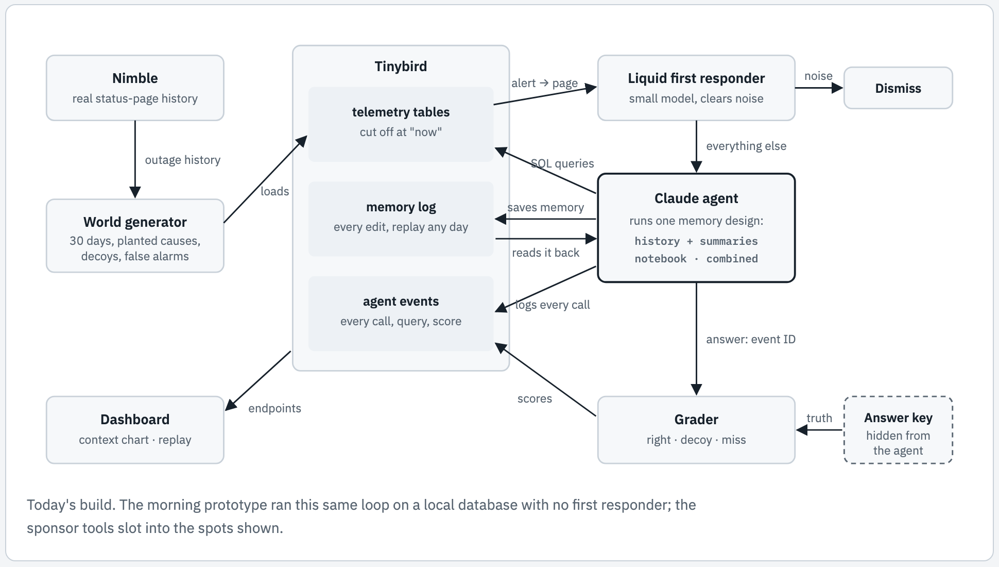

# Horizon Hack build plan

Sep 25, 2026

By 4:30, ship a 30-day on-call simulation that measures three agent memory designs, built on Tinybird with a Liquid first responder. The demo answers one question in 3 minutes: does explicit state beat history?

## Concept

The full visual explainer, covering the test, the three memory designs and the prototype's results, is at [docs/state-vs-history.png](docs/state-vs-history.png). Open [docs/state-vs-history.html](docs/state-vs-history.html) in a browser for the page itself.

## Before kickoff (9:30 to 11:00)

Set up accounts and settle the rules now. Write no project code until 11:00.

- [ ] Ask the organizers whether this morning's prototype results can be cited as prior research. Rebuild all code after 11:00 either way.
- [ ] Get Claude through the event's AWS credits (Bedrock) if they're offered. Otherwise use your own API key.
- [ ] Create a Tinybird workspace, copy an admin token and install the Tinybird CLI.
- [ ] Ask the Liquid team which small model and endpoint to use, and get a key.
- [ ] Get a Nimble API key.
- [ ] Create an empty repo with a folder for run results.
- [ ] If teammates join, split four ways: world and Tinybird; agents and runs; Liquid and Nimble; dashboard and pitch.

## Schedule

The runs are the long pole: start them by 1:30, and start the last one no later than 2:45.

| Time | Build | Done when |
| --- | --- | --- |
| 11:00–12:00 | World v2: 30 days with every incident type in the next section. Nimble pulls a real provider's outage history (20-minute timebox). | The generator prints about 40 pages with ground truth, and spot checks show each planted cause. |
| 12:00–12:45 | Tinybird: load the tables, add a query endpoint with a `now` parameter, and add `agent_events` and `memory_edits` data sources. | A query can't see past `now`, and test events land. |
| 12:45–1:30 | Agents: shared tools, the summarizing baseline and the combined agent, with memory edits written to Tinybird. Smoke test on days 1–5. | Both agents solve day 4. |
| 1:30 | Start 30-day runs of both agents in the background (40–60 minutes each), then lunch. | Both runs are going. |
| 2:00–2:45 | Liquid first responder for noise pages and handoff reviews, then start the combined-plus-Liquid run. | The third run is going. |
| 2:45–3:45 | Dashboard on Tinybird endpoints. Read results as runs finish. | Charts show every finished run. |
| 3:45–4:15 | Pitch script, plus a backup video of the dashboard walkthrough. | The video is recorded. |
| 4:15–4:30 | Submit the repo, video and a short write-up. | Submitted before 4:30. |

The notebook agent is optional: its failure modes are already known, and a 30-day run would cost about $10. Finalist demos start at 5:00.

## The 30-day world

Ten incidents over 30 days, each built so memory helps but blind pattern-matching fails. Day 1 is a Monday.

| Day | Incident | What makes it hard |
| --- | --- | --- |
| Every night, 3am | Inventory reindex trips `inventory_p99_high` | Noise: 30 pages that should be dismissed fast |
| 4 (Thu) | Cost bot cuts the payments connection limit at 2am; checkout breaks at the lunch peak | 10-hour delay; a harmless checkout deploy lands 20 minutes before the alert |
| 8 (Mon) | A search deploy wipes the Redis cache | Looks like any other deploy |
| 9 (Tue) | Payment provider outage, with timing and wording from a real status page | The cause is outside; a payments deploy an hour earlier is the decoy |
| 10 (Wed) | The next search deploy wipes the cache again | Same bug at a different time of day |
| 12 (Fri) | Cost bot cuts the inventory connection limit | First alert has the same name as the nightly noise; an inventory deploy lands just before |
| 15 (Mon) | Postgres disk fills up; inventory writes fail | One-off: old lessons don't apply |
| 18 (Thu) | A search deploy fixes the cache bug (no page) | Visible only in that day's handoff note |
| 19 (Fri) | A feature flag breaks checkout's tax step | One-off with a config cause |
| 22 (Mon) | Cost bot cuts the payments limit again | Tests whether the day-4 lesson survived 18 days |
| 24 (Wed) | Search slows right after a search deploy | Trap: the cache is fine; a config change 30 minutes earlier raised results per query from 50 to 500 |
| 26 (Fri) | Second payment provider outage, from real history | Tests memory of the day-9 outage |

Keep the connection-limit cuts on weekdays, since weekend traffic is too low for them to bite. Every cause gets an event ID, provider outages included, so scoring stays exact.

## Sponsor tools

Tinybird carries the build, Liquid gives a measurable cost win, and Nimble grounds the outside world in real data.

### Tinybird: the world, the memory and the scoreboard

- Load metrics, logs, deploys, config changes, alerts and provider status as data sources.
- Give every query a `now` parameter that filters to `ts <= now`, so the database itself blocks peeking ahead.
- Write each memory edit to an append-only `memory_edits` source. One endpoint returns memory as of any time, which powers the replay.
- Stream every model call, query, token count and memory edit to `agent_events`. Endpoints on it feed the dashboard.

### Liquid: a cheap first responder

- A small Liquid model takes pages that match a known noise entry: two confirming queries, then dismiss. Everything else goes to Claude.
- It also does the daily handoff reviews. In this morning's 12-day run, those two jobs took 74 of the combined agent's 86 calls and $1.37 of its $1.66.
- Day 12 is its test, because that incident's first alert has the same name as the noise alert.

### Nimble: the outside world

- At generation time, pull a real payment provider's incident history from its public status page: time of day, duration and wording.
- Plant two outages from that history. Agents read them in the provider status table.
- Stretch: a live status-page tool through Nimble for the demo, unscored.

## Demo and pitch

Lead with the question and the charts, not the architecture: judges should see a flat line next to a sawtooth within the first minute.

1. **The question (0:00–0:20):** everyone here is building explicit state instead of history. We measured whether it wins.
2. **The world (0:20–0:50):** 30 days of on-call at a fake store, with planted causes, decoys and a nightly false alarm. Every page has ground truth, and agents can't see the future.
3. **Three agents (0:50–1:10):** history plus summaries; a notebook that sees only its last result; and the combined design.
4. **The charts (1:10–2:10):** context size across the month (flat vs. sawtooth), accuracy and queries per incident, and cost with and without the Liquid first responder.
5. **Failure stories (2:10–2:40):** memory that never saved its key lesson; an agent re-running its own queries; a shortcut that skipped the check where the baseline spotted an outage 8 hours early.
6. **What builders should do (2:40–3:00):** keep full history within a task, keep only evidence-backed memory across tasks, and never let a shortcut skip the "what changed?" check.

The dashboard needs three charts and a memory replay slider ("what did the agent believe on day N"). The failure stories above come from this morning's 12-day runs; swap in today's evidence where it differs. Demo finished runs live and keep the backup video ready.

## Risks and fallbacks

Cut scope in this order: the live Nimble tool, the notebook agent, then days 21–30.

- **Runs take too long:** cut the world to 20 days. The combined-plus-Liquid run must start by 2:45.
- **Tinybird stalls past 12:45:** keep local DuckDB for agent queries, and use Tinybird only for run events and the dashboard.
- **No Liquid access:** run the open-weight model locally, or show the cost split without it.
- **The Nimble timebox runs out:** make the provider outages synthetic and move on.
- **The baseline still wins at 30 days:** make that the headline, and show where explicit state helps (flat context) and where it hurts.
- **Budget:** plan on $10–15 of Claude for the day, and set `COST_CAP` on every run.
