# DéjàVu — Interactive Long-Horizon Memory Architecture

DéjàVu is a **long-horizon agent memory system**. The core problem is not merely detecting failures; it is deciding, over months of accumulated experience, **what the agent should remember now**.

The memory engine continuously decides whether new evidence should **ADD**, **REVALIDATE**, **SUPERSEDE**, **INVALIDATE**, **CONSOLIDATE**, or **ARCHIVE** existing memory while preserving immutable historical evidence.

Two scenarios exercise the system:
1. **External API contract change** — an API/SDK/documentation change makes previously correct knowledge or mitigations stale.
2. **Past log/metric trajectory** — the system remembers the sequence preceding a historical failure and recognizes that trajectory before a future failure.

## 1. Complete top-level flow

This is the **one diagram to understand DéjàVu**. There are two inputs into the same long-horizon memory system:

- **Internal:** production logs, metrics, events, errors.
- **External:** SDK/API/docs/changelog changes.

The key idea is simple: **Institutional Memory can keep growing, while the Context Builder gives the LLM a small, fixed working context.**

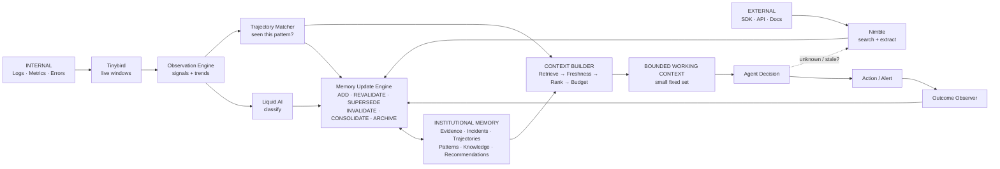

### Read it in one sentence

```text
Internal events OR external changes
        ↓
understand what changed
        ↓
update / retrieve Institutional Memory
        ↓
Context Builder selects only what matters NOW
        ↓
fixed-size Working Context
        ↓
Agent decides
        ↓
outcome becomes new memory
```

## 2. Flat context: memory grows, context does not

This is a core long-horizon property, not an optimization detail.

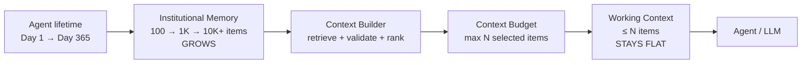

```text
Institutional Memory
10K |                              /
    |                          /
 5K |                     /
    |                /
 1K |          /
    |     /
  0 +--------------------------------→ time
       Day 1      Day 30      Day 365

Working Context
 N  |--------------------------------  ← fixed budget
    |
  0 +--------------------------------→ time
```

**DéjàVu's memory grows with the lifetime of the agent. Its context window doesn't.**

## Struct object model

```ts
type MemoryStatus =
  | "active" | "needs_validation" | "stale" | "superseded"
  | "conflicted" | "invalidated" | "archived";

type Evidence = {
  id: string;
  type: "metric_window" | "log_pattern" | "api_documentation"
      | "api_changelog" | "web_source" | "deployment" | "human_feedback";
  source: string;
  observedAt: string;
  payload: unknown;
  hash: string;
  immutable: true;
};

type ObservationWindow = {
  start: string; end: string; service: string;
  errorRate: number; p99Ms: number; throughput: number;
  queueDepth?: number; poolUtilization?: number;
  retryRate?: number; outboundRps?: number;
  slopes: Record<string, number>;
  accelerations: Record<string, number>;
};

type Trajectory = {
  id: string;
  windowSeconds: number;
  signals: Array<{name: string; values: number[]; slope: number; acceleration: number}>;
  ordering: string[];
  outcome?: "outage" | "degradation" | "recovered";
  evidenceIds: string[];
};

type Incident = {
  id: string; service: string; startedAt: string; resolvedAt?: string;
  trajectoryId: string; rootCause?: string; mitigation?: string; outcome?: string;
  evidenceIds: string[]; confidence: number;
  status: "open" | "resolved" | "reclassified";
};

type FailurePattern = {
  id: string; name: string; derivedFromIncidentIds: string[];
  prototypeTrajectoryId: string; leadingIndicators: string[];
  recommendationIds: string[]; sampleCount: number; confidence: number;
  version: number; status: MemoryStatus; lastValidatedAt: string;
};

type Knowledge = {
  id: string; subject: string; claim: string; sourceEvidenceIds: string[];
  dependencies: Array<{provider?: string; api?: string; apiVersion?: string; sdk?: string}>;
  validFrom: string; validUntil?: string; lastValidatedAt: string;
  nextValidationAt?: string; version: number; confidence: number;
  status: MemoryStatus; supersededBy?: string;
};

type Recommendation = {
  id: string; problem: string; action: string;
  basedOnKnowledgeIds: string[]; basedOnPatternIds: string[];
  createdAt: string; lastValidatedAt: string; status: MemoryStatus;
  supersededBy?: string;
};

type MemoryMutation = {
  id: string;
  operation: "ADD" | "REVALIDATE" | "SUPERSEDE" | "INVALIDATE" | "CONSOLIDATE" | "ARCHIVE";
  targetId: string; causedByEvidenceIds: string[]; createdAt: string; reason: string;
};

type LiquidClassification = {
  class: "connection_pool_exhaustion" | "retry_amplification" | "slow_downstream"
       | "memory_pressure" | "api_contract_change" | "unknown";
  confidence: number;
  evidence: string[];
};

type AgentDecision = {
  diagnosis: string; trajectoryMatchId?: string; knowledgeIds: string[];
  evidenceIds: string[]; recommendationId?: string; uncertainty: number;
  requiresExternalInvestigation: boolean; requiresHumanApproval: boolean;
};
```

## Memory Update Engine

**Purpose:** turn observations into a trustworthy memory state over a long horizon.

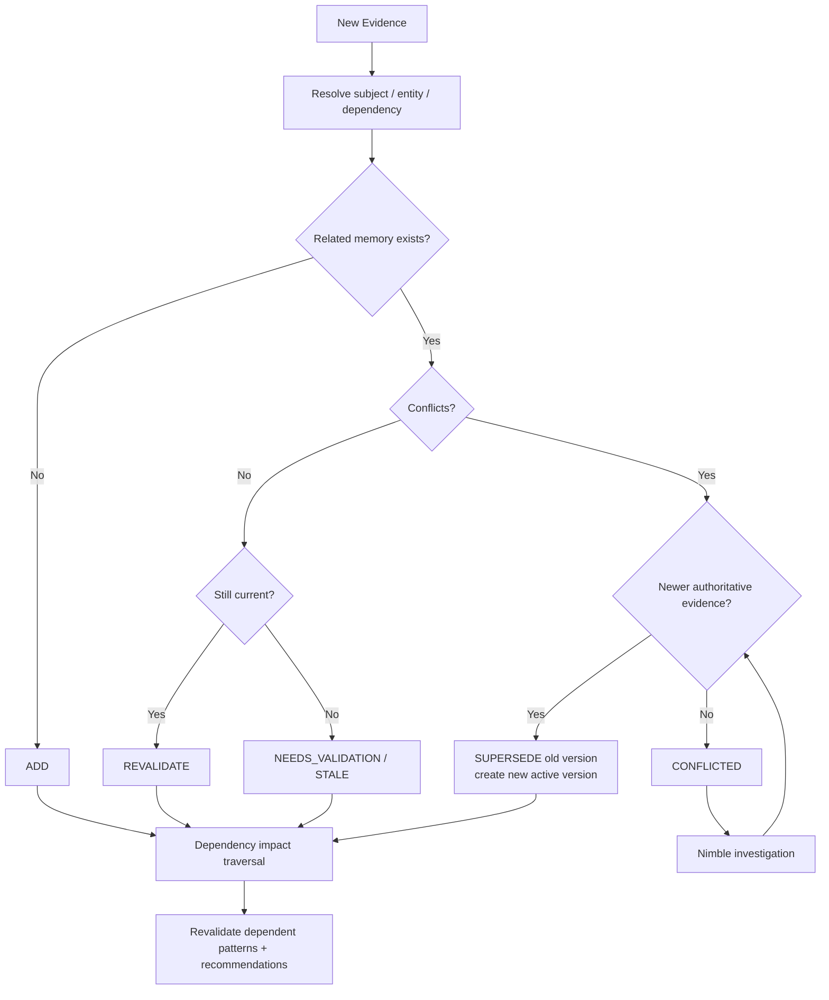

| Situation | Mutation | Historical data |
|---|---|---|
| Brand-new fact/pattern | ADD | Preserve |
| Same fact confirmed | REVALIDATE | Preserve |
| New authoritative guidance | SUPERSEDE | Preserve old version |
| Claim proven wrong | INVALIDATE | Preserve with invalid status |
| Duplicate derived memories | CONSOLIDATE | Preserve source evidence |
| No longer useful for active retrieval | ARCHIVE | Preserve |
| Raw evidence | Never delete/rewrite | Immutable |

Historical truth and current truth are different objects connected by provenance.

[↑ Back to complete flow](#complete-flow)

## Institutional Memory

**Purpose:** preserve the agent's experience across time while keeping current knowledge trustworthy.

Institutional Memory stores six simple things:

```text
Evidence → Incidents → Trajectories → Patterns
    │                                   │
    └────────→ Knowledge ─────────→ Recommendations
```

Raw evidence and historical incidents are preserved. Derived knowledge can change status or version as the world changes.

### How memory is managed

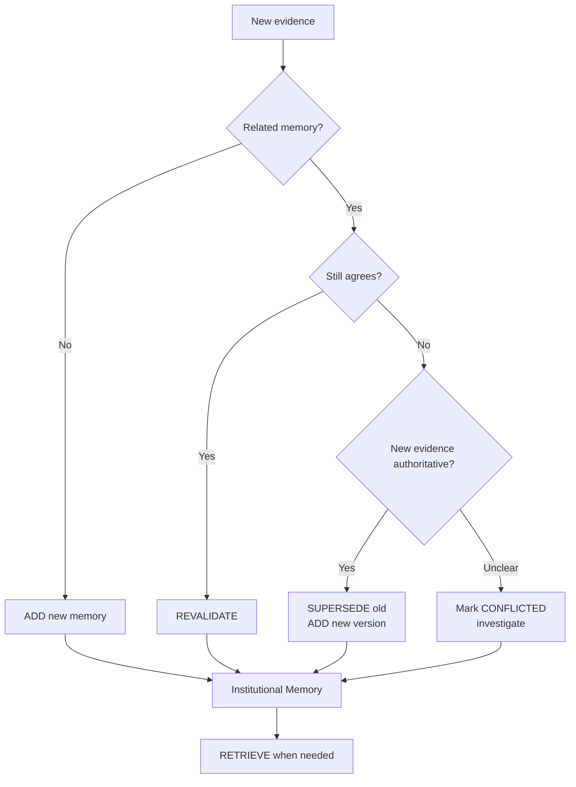

### Internal path — logs / events / errors

This is how production experience becomes memory.

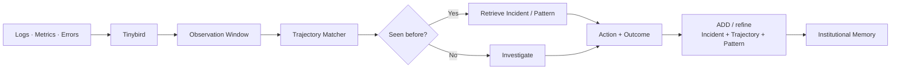

Example: `pool ↑ → queue ↑ → p99 ↑ → timeouts ↑ → outage`. The pre-failure sequence is stored so the next occurrence can be recognized earlier.

### External path — SDK / API / docs change

This is how the agent prevents old knowledge from becoming bad advice.

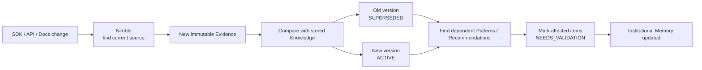

**Important:** the old knowledge is not deleted. We preserve **what was true then** separately from **what is safe to recommend now**.

### ADD vs UPDATE vs RETRIEVE

| Operation | Meaning |
|---|---|
| **ADD** | New incident, evidence, trajectory, pattern, or knowledge |
| **REVALIDATE** | Existing knowledge is checked and still true |
| **SUPERSEDE** | New authoritative version replaces current use of old knowledge |
| **INVALIDATE** | A belief is shown to be wrong; history is preserved |
| **CONSOLIDATE** | Merge duplicate derived memories without deleting source evidence |
| **ARCHIVE** | Remove old items from normal retrieval, not from history |
| **RETRIEVE** | Context Builder selects relevant, valid memories for the current decision |

[↑ Back to top-level flow](#1-complete-top-level-flow)

## Trajectory Matcher

**Purpose:** recognize a developing failure from the *sequence* before thresholds fire.

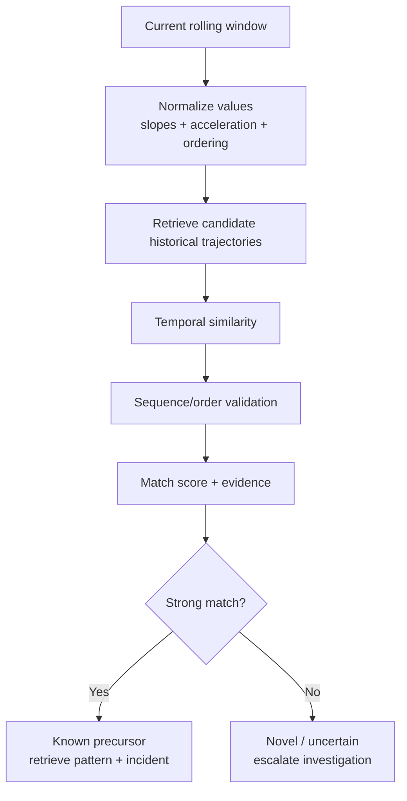

```text
Historical: pool ↑ → queue ↑ → p99 ↑ → timeouts ↑ → outage
Current:    pool ↑ → queue ↑ → p99 ↑

Absolute values can still be under alert thresholds.
The trajectory itself is the warning.
```

[↑ Back to complete flow](#complete-flow)

## Context Builder

**Purpose:** convert a large, growing Institutional Memory into a **small, trustworthy, bounded working set** for the current decision.

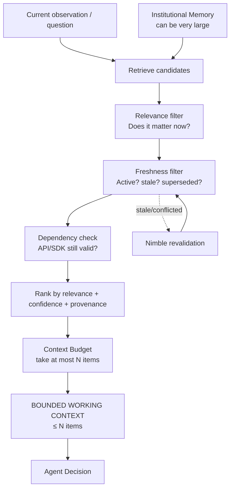

The Context Builder does **not** summarize the entire lifetime into the prompt. Old evidence stays in Institutional Memory for history/provenance, but only relevant and currently valid items consume working context.

Example:

```text
12,481 memory objects
        ↓ retrieve
       37 candidates
        ↓ relevance
       11
        ↓ freshness/dependency validation
        6
        ↓ context budget (max 8)
   WORKING CONTEXT = 6 / 8
        ↓
   Agent Decision
```

[↑ Back to top-level flow](#1-complete-top-level-flow)

## Observation Engine

**Purpose:** convert noisy production events into comparable temporal observations.

Raw events → rolling window → normalized features → trajectory → Liquid classification + trajectory matching.

[↑ Back to complete flow](#complete-flow)

## Tinybird

**Purpose:** real-time telemetry/event layer.

Tinybird ingests production events and exposes rolling windows such as error rate, latency, retries, pool utilization, queue depth, and their recent trends. It supplies the Observation Engine; it is not the long-term memory authority.

[↑ Back to complete flow](#complete-flow)

## Liquid AI

**Purpose:** lightweight semantic classification, not magical outage probability.

Liquid interprets relationships/order among signals or classifies an incoming knowledge change. Deterministic code handles temporal similarity and memory state transitions.

```text
risk =
  0.30 * anomaly_score
+ 0.50 * trajectory_similarity
+ 0.20 * classifier_confidence
```

Display this as a **risk score**, not an outage probability unless statistically calibrated. Never invent similarity or lead-time values in the demo.

[↑ Back to complete flow](#complete-flow)

## Nimble

**Purpose:** give the agent current external evidence when internal memory is insufficient or potentially stale.

```text
Novel failure
→ Search → Extract → Web Search Agent if ambiguous
→ evidence → Memory Update Engine

Known external dependency needs revalidation
→ Search authoritative docs/changelog
→ Extract changed contract
→ evidence → dependency impact analysis
```

Nimble output becomes immutable `Evidence`; the Memory Update Engine decides what it changes.

**Escalation:** local memory first, web search second, autonomous research only when uncertainty demands it.

[↑ Back to complete flow](#complete-flow)

## Agent Decision

**Purpose:** combine current observations with *currently valid* institutional memory.

```text
FAILURE DEVELOPING
      ↓
Seen before?
      ↓
Historical incident / pattern
      ↓
What worked last time?
      ↓
Is that knowledge STILL VALID?
   ↙                 ↘
 YES                  NO
  ↓                    ↓
Known fix       Nimble researches
  ↓             current external truth
  └──────────┬─────────┘
             ↓
       CURRENT ACTION
```

The decision layer must never treat a superseded or stale recommendation as current without revalidation.

[↑ Back to complete flow](#complete-flow)

## Action / Alert

**Purpose:** surface a safe next step.

For the demo, actions remain human-visible/confirmable: early warning, current diagnosis, historical precedent, current validated mitigation, and supporting evidence.

```text
⚠ DÉJÀVU DETECTED

Production is following the trajectory that preceded Incident #12.

Likely: Connection Pool Exhaustion
Observed: Pool ↑ → Queue ↑ → P99 ↑
Previous root cause: leaked DB connections
Previous mitigation: restart workers + fix connection cleanup
Knowledge status: VALIDATED
```

[↑ Back to complete flow](#complete-flow)

## Outcome Observer

**Purpose:** close the learning loop.

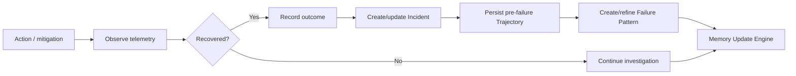

This is what makes an unknown failure today become a known precursor tomorrow.

[↑ Back to complete flow](#complete-flow)

# Scenario A — External API contract changes

This demonstrates **staleness, versioning, dependency impact, and revalidation**.

```text
Knowledge K-17
subject: Payment API retry behavior
claim: fixed 1-second retry
API: v2
status: ACTIVE
version: 1

OLD:
429 → fixed 1-second retry

NEW:
429 → respect Retry-After dynamically
recommended exponential backoff + jitter
old fixed retry behavior deprecated
```

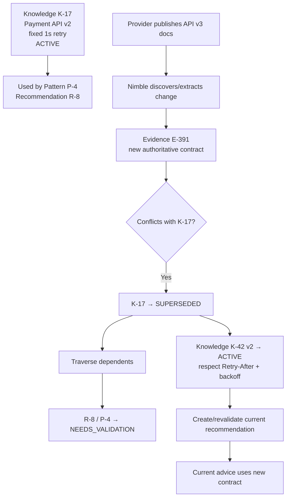

```text
BEFORE API CHANGE

K-17 ● ACTIVE
  └── R-8 ● ACTIVE

        ↓ external change detected

AFTER

K-17 ○ SUPERSEDED
  └── R-8 ⚠ NEEDS_VALIDATION

K-42 ● ACTIVE
  └── R-19 ● ACTIVE
```

The historical incident is **not rewritten**. DéjàVu preserves what was true then separately from what it recommends now.

# Scenario B — Past trajectory predicts a future failure

Past Incident #12:

```text
10:00 DB pool usage ↑
10:02 DB pool usage ↑↑
10:04 queue depth ↑
10:06 P99 latency ↑
10:08 timeouts ↑
10:10 💥 OUTAGE
```

Three months later:

```text
11:20 DB pool usage ↑
11:22 DB pool usage ↑↑
11:24 queue depth ↑
11:26 P99 latency ↑
```

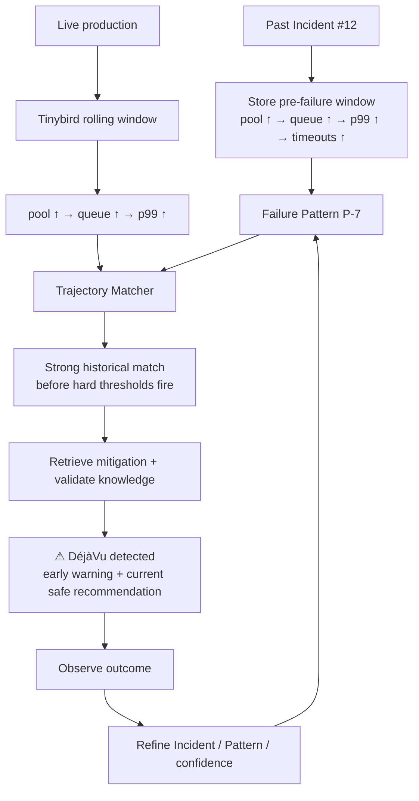

Before recommending the historical mitigation, DéjàVu asks:

> **Have we seen this before — and is what we learned last time still true?**

If supporting knowledge is stale or superseded, Nimble retrieves current external truth before the recommendation is surfaced.

# Novel failure learning loop

A second demo case should not exist in seeded memory.

```text
Incoming RPS 100 → 102 stable
Outbound RPS 120 → 180 → 270 → 410
Retries 2 → 18 → 74 → 230
503s 1 → 7 → 28 → 76
P99 190 → 240 → 480 → 920ms
```

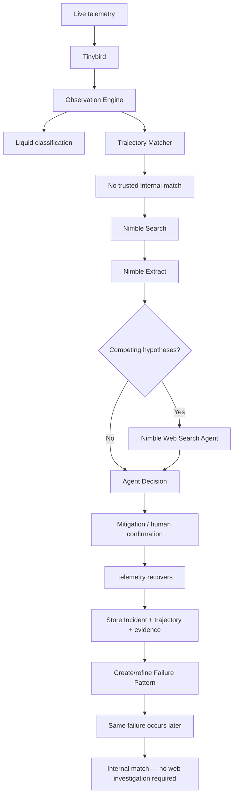

Unknown failure → autonomous investigation → evidence-backed action → observed outcome → institutional memory → future early recognition.

# Interactive demo UI

The actual hackathon frontend should render the top-level architecture as clickable cards/nodes. Selecting a component opens a detail drawer/page containing its purpose, input/output structs, internal flow, current memory objects, mutations it can trigger, provenance/evidence, current status, and a **Back to architecture** control.

```text
DÉJÀVU MEMORY ENGINE

 External World                    Production
      │                                │
      ▼                                ▼
    Nimble                         Tinybird
      │                                │
      │                         Observation Engine
      │                                │
      └─────────────┬──────────────────┘
                    ▼
             Liquid / Evidence
                    │
                    ▼
          ┌────────────────────┐
          │ MEMORY UPDATE      │
          │ ENGINE             │  ← CLICK
          └─────────┬──────────┘
                    ▼
          ┌────────────────────┐
          │ INSTITUTIONAL      │
          │ MEMORY             │  ← CLICK
          └──────┬───────┬─────┘
                 │       │
                 ▼       ▼
          Trajectory   Knowledge
           Matcher     Retriever
            CLICK        CLICK
                 │       │
                 └───┬───┘
                     ▼
               Agent Decision
                     │
                     ▼
                Action/Alert
                     │
                     ▼
              Outcome Observer
                     │
                     └──────────→ Memory Update
```

### Institutional Memory drill-down

```text
INSTITUTIONAL MEMORY
────────────────────────────────────────
Evidence → Incidents → Trajectories → Patterns
                         ↓
                      Knowledge → Recommendations

ACTIVE          31
STALE            4
SUPERSEDED       7
CONFLICTED       1
```

### Trajectory Matcher drill-down

```text
TRAJECTORY MATCHER
──────────────────────────────────────
Live Window
     ↓
Feature normalization
     ↓
Temporal comparison
     ├── Incident #12
     ├── Incident #17
     └── Incident #21
     ↓
Sequence validation
     ↓
Failure Pattern
```

Any similarity values displayed in the real demo must be **actually computed**.

### Memory object drill-down

```text
KNOWLEDGE K-42
─────────────────────────────
Payment API retry behavior

Version             2
Status              ACTIVE
Confidence          0.96
Created             Sep 25
Last validated      Sep 25

Supersedes
└── K-17

Evidence
├── API documentation E-391
└── Provider changelog E-392

Used by
├── Pattern P-4
└── Recommendation R-19
```


## 4-hour implementation architecture

The demo implementation keeps **lifetime history**, **current memory state**, and **LLM working context** separate. This prevents both database reads and LLM context from growing with the full history.

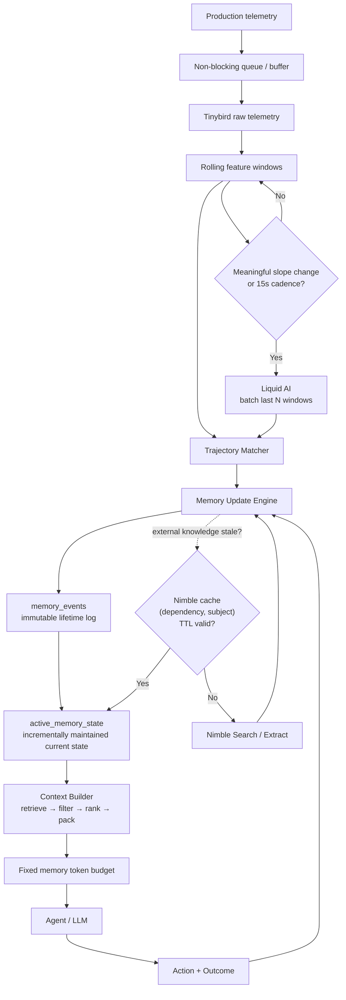

### 1. Keep current memory state incremental

Do **not** rebuild current state by grouping the entire `memory_events` history on every request.

```text
memory_events
immutable append-only history
10 → 1K → 100K → millions
          │
          │ incrementally maintain on write
          ▼
active_memory_state
current version/status of each memory
          │
          │ reads
          ▼
Context Builder
```

The implementation should use the Tinybird-supported incremental/materialized pattern available in the environment for `active_memory_state`. The architectural requirement is: **update current state when memory events arrive; never replay all historical mutations during normal retrieval.**

This gives us two separate scaling guarantees:

```text
Lifetime history grows
       ↓
Incremental current state
(no full-history replay on read)
       ↓
Candidate retrieval
       ↓
Fixed memory token budget
(no growing LLM memory context)
```

### 2. Batch and gate Liquid AI classification

Do not call Liquid for every 2–3 second telemetry tick.

```text
Tinybird windows
      ↓
Has a meaningful feature/slope changed?
      │
   NO ├────→ keep collecting
      │
  YES ▼
Batch last N windows
      ↓
Liquid classification
```

For the demo, classify on either a meaningful feature/slope change or a fixed cadence such as ~15 seconds. This keeps classification responsive while avoiding repeated inference over nearly identical windows.

### 3. Cache Nimble revalidation

Nimble is invoked when external knowledge is missing or stale, not every time a similar incident occurs.

Cache key:

```text
(dependency, subject)
```

Decision:

```text
Need external knowledge
        ↓
Find current Knowledge object
        ↓
lastValidatedAt + TTL > now?
       /                 \
     YES                  NO
      │                    │
use stored             Nimble Search
knowledge              + Extract
                           │
                           ▼
                     new Evidence
                           │
                           ▼
                  Memory Update Engine
```

The existing `lastValidatedAt` field therefore serves both memory freshness and external-lookup caching.

### 4. Trajectory similarity: simple now, ANN later

For the hackathon, candidate sets are small enough that deterministic linear-scan similarity is simpler to implement and debug.

```text
Current trajectory
      ↓
candidate historical trajectories
      ↓
normalize features
      ↓
cosine / weighted temporal similarity
      ↓
rank matches
```

When the case library grows beyond hundreds/thousands of trajectories, replace broad linear scanning with an approximate-nearest-neighbor/vector index for candidate generation. Keep exact/weighted temporal validation after candidate retrieval.

**Do not spend hackathon build time implementing ANN.**

### 5. Decouple ingestion from analysis

Telemetry ingestion must not wait for Liquid, Nimble, or an LLM.

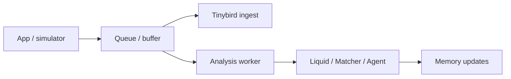

For the demo, this can be a simple in-process asynchronous queue. The important invariant is:

> **Slow inference must never block telemetry ingestion.**

### 6. Optional: precompute hot briefings

Only if core functionality is complete, precompute compact briefings for the top 2–3 likely failure classes during idle time.

```text
Idle time
   ↓
top failure classes
   ↓
retrieve + validate likely memory
   ↓
cached briefing
   ↓
risk threshold crossed
   ↓
fast escalation
```

This is a latency optimization, not required for correctness.

### Build priority

| Priority | Build now | Why |
|---|---|---|
| P0 | Incremental `active_memory_state` | Read path does not replay lifetime history |
| P0 | Batched/gated Liquid calls | Avoid wasteful per-tick inference |
| P1 | Nimble TTL cache | Avoid repeated external research |
| P1 | Non-blocking ingestion buffer | Slow inference cannot block telemetry |
| P2 | Precomputed briefings | Demo latency optimization |
| Later | ANN trajectory index | Scale candidate retrieval beyond small case library |

### What “stays flat” actually means

There are **two different growth problems**, and DéjàVu bounds both:

```text
DATABASE READ PATH

memory_events       100 → 10K → 1M+
                         │
                         ▼
              active_memory_state
              incrementally maintained
                         │
                         ▼
                  candidate query


LLM MEMORY CONTEXT

Institutional Memory 100 → 10K → 1M+
                         │
                         ▼
                   Context Builder
                         │
                         ▼
             MAX_MEMORY_CONTEXT_TOKENS
                         │
                         ▼
               bounded memory context
              ───────────────────────
```

The technically precise claim is:

> **DéjàVu maintains incrementally queryable current memory and a fixed memory-context token budget even as lifetime institutional history grows.**


# Sponsor responsibilities

| Sponsor / Component | Responsibility |
|---|---|
| Tinybird | Live telemetry ingestion, rolling windows, real-time feature computation |
| Liquid AI | Lightweight semantic failure/change classification |
| Nimble Search | External discovery for novel failures and dependency/API changes |
| Nimble Extract | Turn promising pages/docs into structured evidence |
| Nimble Web Search Agent | Autonomous deeper investigation when evidence/hypotheses remain ambiguous |

**Tinybird tells us what the system is doing. Our trajectory engine tells us whether we have seen this shape before. Liquid tells us what kind of failure that behavior represents. Nimble finds current external truth when memory is missing or stale. The Memory Update Engine decides what the agent should remember now.**

# Core principle

```text
DAY 1                                              DAY 365
  │                                                   │
  ▼                                                   ▼
Learns API behavior                            API changed 4×
Learns Incident #1                             200 incidents
Learns mitigation                              old fixes obsolete
Reads docs                                     conflicting evidence
  │                                                   │
  └────────────────── LONG HORIZON ───────────────────┘
                         ↓
              WHAT SHOULD THE AGENT
                 REMEMBER NOW?

              What is still valid?
              What became stale?
              What was superseded?
              What should be merged?
              What must be preserved?
              What needs revalidation?
```

**DéjàVu doesn't just ask “Have we seen this before?” It asks: “Have we seen this before — and is what we learned last time still true?”**
